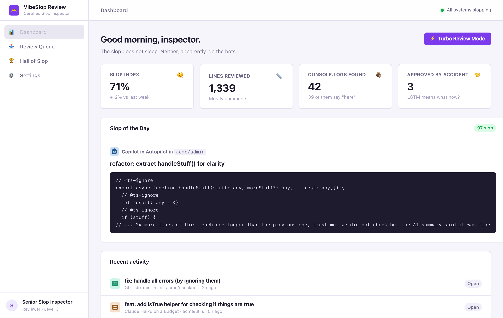
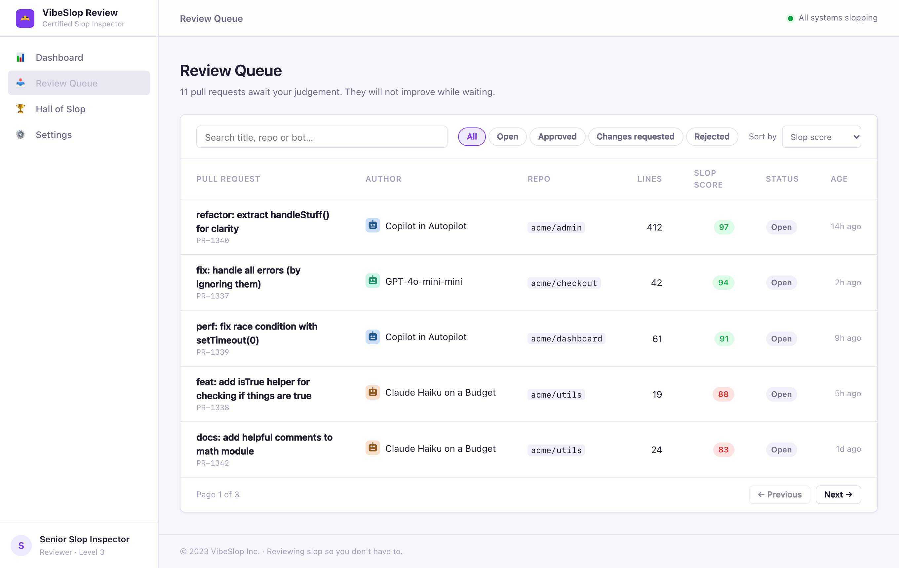
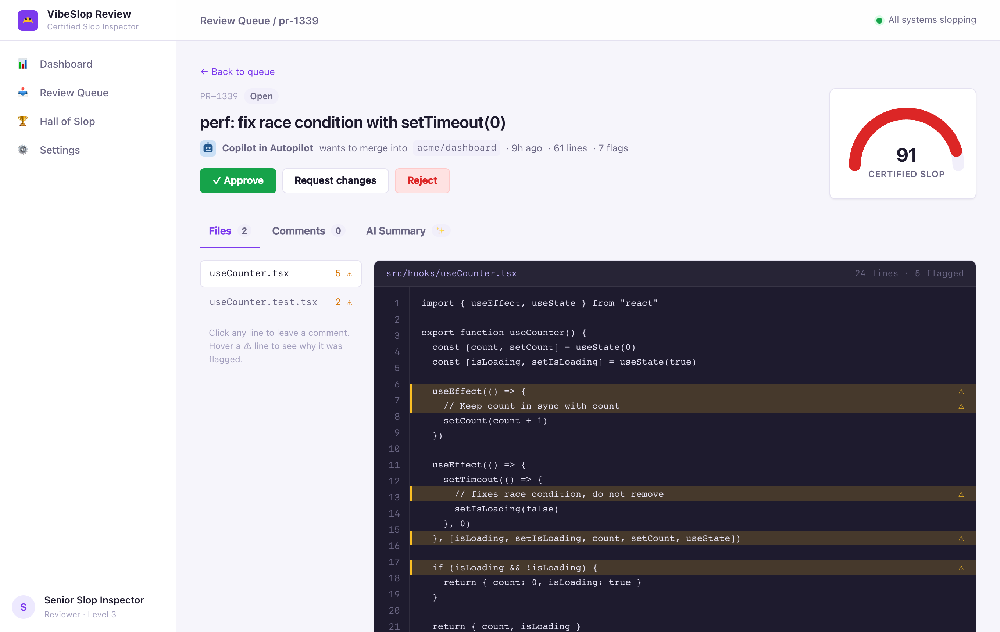
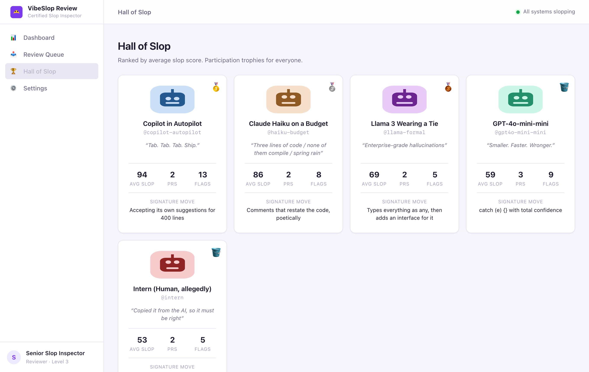
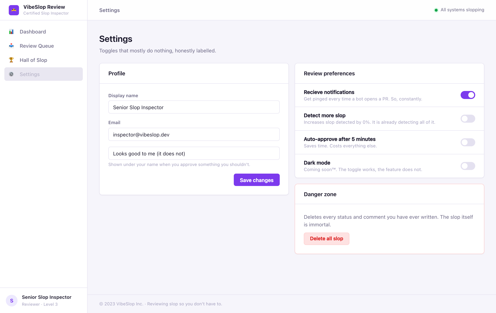
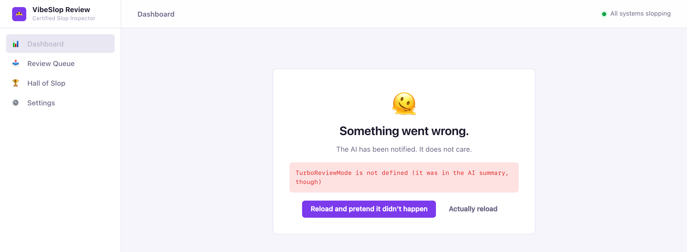

<a href="https://github.com/vepanimas/vibeslop-review">
  
</a>

<p align="center">
  <a href="#-quick-start"></a>
  
  
  
  <a href="./LICENSE"></a>
</p>

<p align="center">
  <strong>A code review tool for pull requests written by machines, reviewed by humans, approved by accident.</strong><br>
  <sub>A small, self-contained React + TypeScript prototype for demoing frontend review workflows. No backend, no accounts, no mercy.</sub>
</p>

<br>

<p align="center">
  
</p>

<br>

## What's inside

VibeSlop Review is a fictional review product for AI-generated pull requests. Five bots (and one intern) open PRs full of `catch (e) {}`, `as any as T`, and comments that confidently describe code that does the opposite. You read them, flag the worst lines, and decide their fate.

<table>
  <tr>
    <td width="50%" valign="top">
      <h3>📊 Dashboard</h3>
      <p>Slop Index, lines reviewed, a 14-day trend and today's most spectacular PR. The <em>Turbo Review Mode</em> button is exactly as well tested as it sounds.</p>
      
    </td>
    <td width="50%" valign="top">
      <h3>📥 Review Queue</h3>
      <p>Search by title, repo or author. Filter by status, sort by slop, page through the backlog. It does not get shorter.</p>
      
    </td>
  </tr>
  <tr>
    <td width="50%" valign="top">
      <h3>🔍 Review Detail</h3>
      <p>An animated slop gauge, a file tree, and a code view with flagged lines and hover explanations. Click any line to comment, or pick a canned remark. Approve triggers confetti. Reject takes three tries.</p>
      
    </td>
    <td width="50%" valign="top">
      <h3>🏆 Hall of Slop</h3>
      <p>Bots ranked by average slop score, with their signature move. Medals for the podium, a bucket for everyone else.</p>
      
    </td>
  </tr>
  <tr>
    <td width="50%" valign="top">
      <h3>⚙️ Settings</h3>
      <p>A profile form, toggles that honestly describe what they don't do, and a Danger Zone that resets everything you've ever decided.</p>
      
    </td>
    <td width="50%" valign="top">
      <h3>🫠 Error boundary</h3>
      <p>When things go wrong, they go wrong on brand. Recover in place or actually reload.</p>
      
    </td>
  </tr>
</table>

## Meet the authors

| Bot | Tagline | Signature move |
|-----|---------|----------------|
| **GPT-4o-mini-mini** | Smaller. Faster. Wronger. | `catch (e) {}` with total confidence |
| **Claude Haiku on a Budget** | Three lines of code / none of them compile / spring rain | Comments that restate the code, poetically |
| **Copilot in Autopilot** | Tab. Tab. Tab. Ship. | Accepting its own suggestions for 400 lines |
| **Llama 3 Wearing a Tie** | Enterprise-grade hallucinations | Types everything as `any`, then adds an interface for it |
| **Intern (Human, allegedly)** | Copied it from the AI, so it must be right | Leaving `console.log("here")` in production |

## 🚀 Quick start

```sh
pnpm install
pnpm dev
```

Open <http://localhost:5173>. Everything you approve, reject or comment on is persisted to `localStorage`, so the queue remembers your sins between reloads.

| Script | What it does |
|--------|--------------|
| `pnpm dev` | Vite dev server with HMR |
| `pnpm build` | Type-check (`tsc -b`) and produce a production bundle in `dist/` |
| `pnpm preview` | Serve the production bundle locally |
| `pnpm lint` | Run oxlint |

## 🧱 Under the hood

- **React 19 + TypeScript (strict)** on **Vite 8**, no UI framework.
- **react-router v7** in declarative mode: `/`, `/queue`, `/review/:id`, `/hall-of-slop`, `/settings`, and a 404 for pages the AI hallucinated.
- **CSS Modules** per component on top of a small token sheet (`src/styles/tokens.css`) for colour, spacing, radii and type.
- **State** is a single `useReducer` store in React context, persisted to `localStorage` under the key `vibeslop:definitely-not-a-database`.
- **Data** is static TypeScript: bots, pull requests, the flagged lines and their explanations. No network requests, ever.
- Hand-drawn SVG for the slop gauge, sparkline and bot avatars. Confetti is pure CSS.

```
src/
├─ app/          AppShell (sidebar, top bar, footer) and ErrorBoundary
├─ components/   Button, Badge, Card, StatTile, Avatar, Modal, Toast, CodeBlock, SlopMeter, Sparkline…
├─ data/         bots, reviews (the slop itself), canned comments
├─ pages/        Dashboard, Queue, ReviewDetail, HallOfSlop, Settings, NotFound
├─ store/        types, reducer + context, score helpers
└─ styles/       tokens.css, global.css
```

## Adding more slop

Pull requests live in `src/data/reviews.ts`. Each one is a plain object: a title, an author, one or more files as arrays of lines, and a list of flagged line numbers with a one-line reason. Add a bot in `src/data/bots.ts` and it appears in the Hall of Slop automatically.

## License

[MIT](./LICENSE). The bots are fictional. Any resemblance to real pull requests is statistically inevitable.
